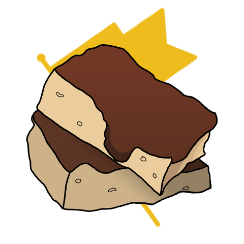

## Writeups for some challenges of BrunnerCTF 2026

### BrunnerCTF 2026

  

Welcome to BrunnerCTF 2026. The entire team at Brunnerne have been cooking and baking new exciting challenges for you to try, as we've expanded from a small home-bakery startup into an international unicorn as Brunnerne Inc.™, with this year's theme: "Brunnerne goes corporate". Whether you are a completely new CTF intern or a senior executive vice president of CTF competitions, there will be delicious challenges waiting for you. This includes our beginner-friendly category now rebranded as "Onboarding". The category features plenty of opportunities to learn the basics, and the chance to ask us for hints on Discord if you get stuck. And although Brunnerne Inc.™ is now a global phenomenon, we promise plenty of traces of traditional Danish pastry.

Duration: Fri, 21 Aug. 2026, 12:00 UTC — Sun, 23 Aug. 2026, 12:00 UTC

Team Limit: 5 members

Website: ctf.brunnerne.dk

Discord: https://discord.gg/wPaa2kdM97

---

### Table of Contents

| Category   | Challenge                                      |
|------------|------------------------------------------------|
| Web        | [Secret Event](./Secret_Event.md)              |
| OSINT      | [Trivago](./Trivago.md)                        |
| OSINT      | [Unknown Artist ](./Unknown_Artist.md)         | 
| OSINT      | [The North Star Metric](./The_North_Star_Metric.md)|
| Boot2Root  | [Brunner Mifflin (User)](./Brunner_Mifflin_(User).md)|
| Boot2Root  | [Brunner Mifflin (Root)](./Brunner_Mifflin_(Root).md)|

---

Writeups in this repository were written by [Carax49](https://github.com/Carax49).