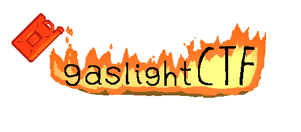

## Writeups for some challenges of gaslightCTF-2026

### scriptCTF-2026

  

gaslightCTF is a jeopardy-style capture the flag competition open to everyone — from complete beginners to more advanced players. Teams of up to five can compete across three divisions: Secondary School, University, and Open.

Duration: Fri, 14 Aug. 2026, 12:00 UTC — Mon, 17 Aug. 2026, 12:00 UTC

Team Limit: 5 members

Discord: https://discord.gg/6nGCQcasP6

---

### Table of Contents

| Category   | Challenge                                      |
|------------|------------------------------------------------|
| Web        | [biscuit](./biscuit.md)                        |
| Web        | [crawl](./crawl.md)                            |
| Web        | [json-warehouse](./json-warehouse.md)          | 
| OSINT      | [meow](./meow.md)                              |
| OSINT      | [quack](./quack.md)                            | 
| OSINT      | [speedy](./speedy.md)                          | 
| Forensics  | [blackout](./blackout.md)                      |
| Forensics  | [icon-sketch](./icon-sketch)                   |

---

Writeups in this repository were written by [Carax49](https://github.com/Carax49).