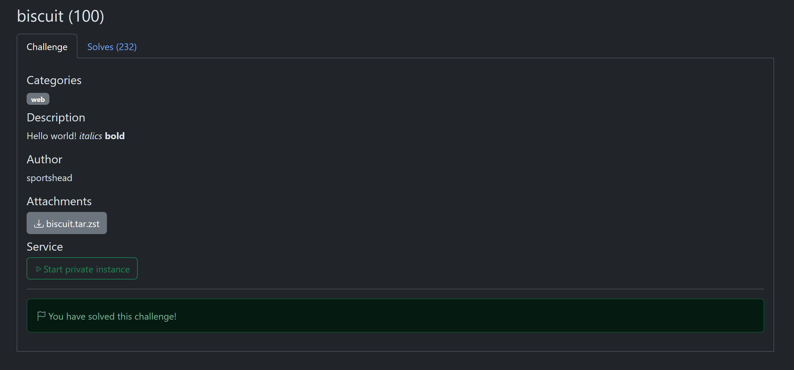
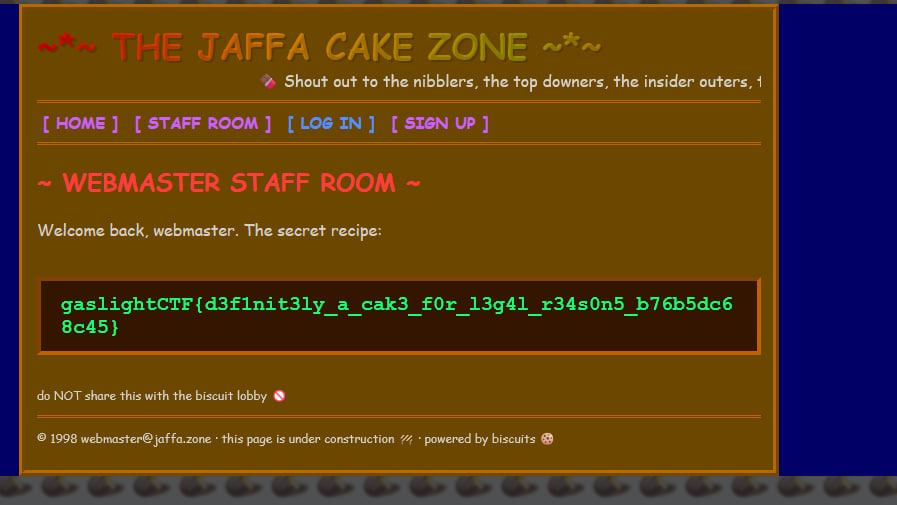

# biscuit

**Author**: carax49<br>
**Date**: 2026-08-18

## Overview

- Category: Web
- Description:

    

## Analysis

In the provided challenge source code, there is a `mint()` function:

```python
def mint(username: str) -> str:
    builder = BiscuitBuilder(
        f"""
        user("{username}");
        check if user($u), $u.length() > 0;
        """,
    )
    if username == "webmaster":
        builder.add_fact(Fact('role("admin")'))
    return builder.build(root.private_key).to_base64()
```

The `username` value is inserted directly into the function without filtering. This can lead to Biscuit Injection.

Also, the token is then signed with the server's private key.

```python
return builder.build(root.private_key).to_base64()
```

This means every payload used to create a token is valid.

## Solution

On the sign-up form, create a new account with this username:

```text
abc");role("admin");("abc
```

The password can be anything.

The token will now contain:

```python
user("abc");role("admin");user("abc");
check if user($u), $u.length() > 0;
```

From there, I could bypass the admin check.

```python
def current_admin() -> str | None:
    return _authorize('allow if user($u), role("admin");')
```

Then I accessed the `/flag` endpoint.



## Flag

```text
gaslightCTF{d3f1nit3ly_a_cak3_f0r_l3g4l_r34s0n5_b76b5dc68c45}
```
