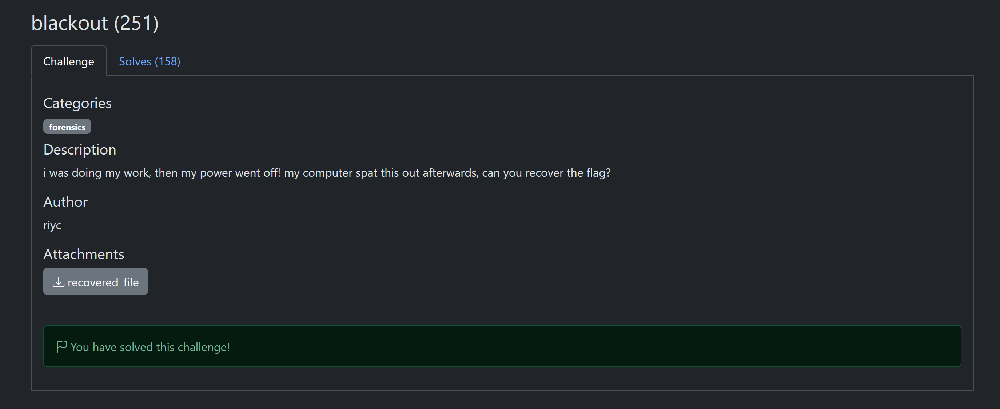

# blackout

**Author**: carax49<br>
**Date**: 2026-08-18

## Overview

- Category: Forensics
- Description:

    

## Analysis

The challenge provides a file named `recovered_file` with no file extension.

To identify its type, I checked its magic bytes.

## Solution

Identify the file type from its magic bytes:

```bash
file recovered_file
```

Output
```bash
recovered_file: PDF document, version 1.4, 8 page(s)
```

So, `recovered_file` is a PDF file.

I added the file extension and tried to open it.


The content is completely blacked out, so it cannot be read normally. However, I could still extract the PDF text with `pdftotext`.

```bash
pdftotext recovered_file.pdf -
```

Because the text is long, I used `grep` to find the flag faster.

```bash
pdftotext recovered_file.pdf - | grep gaslightCTF{
```


## Flag

```text
gaslightCTF{c0w4bung4_f1le_4ev3r}
```
