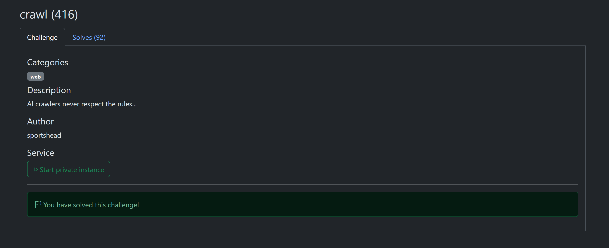
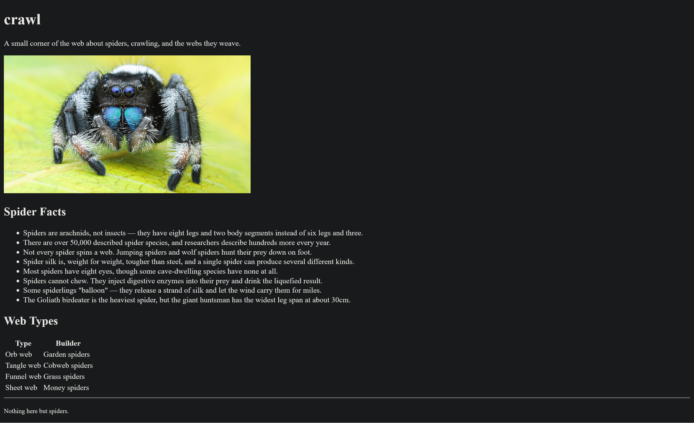
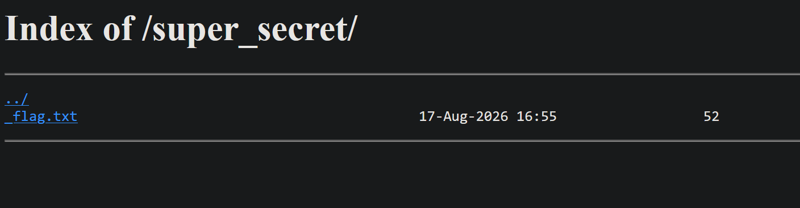

# crawl

**Author**: carax49<br>
**Date**: 2026-08-18

## Overview

- Category: Web
- Description:

    

## Analysis

The challenge provides a static website about spiders.



I checked some common special files on the website, including `robots.txt`.

## Solution

I visited `/robots.txt` and got:

```text
User-agent: *
Disallow: /super_secret/
```

Then I visited `/super_secret/`.



The flag was in `_flag.txt`.

## Flag

```text
gaslightCTF{LLM_1nduc3d_4r4chn0ph0b1a_d8dd2aaff97e}
```
