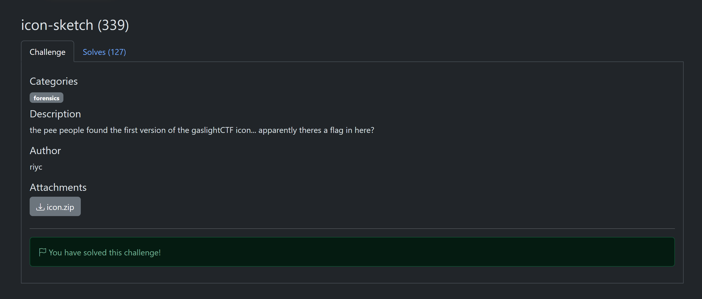

# icon-sketch

**Author**: carax49<br>
**Date**: 2026-08-18

## Overview

- Category: Forensics
- Description:

    

## Analysis

The challenge provides an `icon.zip` file. After extracting it, I got `icon.png`.

I checked the image metadata for hidden information.

## Solution

Use `exiftool` to view the image metadata.

```bash
exiftool icon.png
```

I noticed these three fields because their values are Base64 strings.

```bash
Document Name                   : dGhlIHBlZSBwZW9wbGUgc2FpZCB0byBkZWNvZGUgYW5kIHB1dCB0aGUgdGl0bGVzIHRvZ2V0aGVy
...
Artwork Title                   : MmUgMmUgMmUgMmUgMmUgMmUgMmUgMmUgNDMgNTQgNDYgMmUgMmUgMmUgNWYgMmUgNjggMzQgMmUgNWYgMmUgMmUgNzAgNzAgMzAgNzMgMzMgMmUgMmUgMzIgNjIgNWYgMmUgMzEgNzMgMmUgMmUgN2Q=
...
Title                           : dHpob3J0c2cuLi57cjUuZy4uZy5oZi4uLi4ud18uLi5rLi5oPy4=
```

Base64-decode the value of the `Document Name` field.

```bash
echo "dGhlIHBlZSBwZW9wbGUgc2FpZCB0byBkZWNvZGUgYW5kIHB1dCB0aGUgdGl0bGVzIHRvZ2V0aGVy" | base64 -d
```

Output:

```text
the pee people said to decode and put the titles together
```

From this hint, I needed to decode the other two fields, `Artwork Title` and `Title`, then join them together.

1. **Artwork Title**

    ```bash
    echo "MmUgMmUgMmUgMmUgMmUgMmUgMmUgMmUgNDMgNTQgNDYgMmUgMmUgMmUgNWYgMmUgNjggMzQgMmUgNWYgMmUgMmUgNzAgNzAgMzAgNzMgMzMgMmUgMmUgMzIgNjIgNWYgMmUgMzEgNzMgMmUgMmUgN2Q=" | base64 -d 
    ```

    Output:

    ```text
    2e 2e 2e 2e 2e 2e 2e 2e 43 54 46 2e 2e 2e 5f 2e 68 34 2e 5f 2e 2e 70 70 30 73 33 2e 2e 32 62 5f 2e 31 73 2e 2e 7d
    ```

    -> This is a hexadecimal string, so I decoded it again.

    ```bash
    echo "MmUgMmUgMmUgMmUgMmUgMmUgMmUgMmUgNDMgNTQgNDYgMmUgMmUgMmUgNWYgMmUgNjggMzQgMmUgNWYgMmUgMmUgNzAgNzAgMzAgNzMgMzMgMmUgMmUgMzIgNjIgNWYgMmUgMzEgNzMgMmUgMmUgN2Q=" | base64 -d | xxd -r -p
    ```

    Output:

    ```text
    ........CTF..._.h4._..pp0s3..2b_.1s..}
    ```

2. **Title**

    ```bash
    echo "dHpob3J0c2cuLi57cjUuZy4uZy5oZi4uLi4ud18uLi5rLi5oPy4=" | base64 -d
    ```

    Output:

    ```text
    tzhortsg...{r5.g..g.hf.....w_...k..h?.
    ```

    -> This string is readable, but it does not make much sense. After looking closely and testing it, I found that it used [Atbash](https://en.wikipedia.org/wiki/Atbash) encoding.

    Decode:

    ```bash
    echo "dHpob3J0c2cuLi57cjUuZy4uZy5oZi4uLi4ud18uLi5rLi5oPy4=" | base64 -d | tr 'A-Za-z' 'ZYXWVUTSRQPONMLKJIHGFEDCBAzyxwvutsrqponmlkjihgfedcba'
    ```

    Output:

    ```text
    gaslight...{i5.t..t.su.....d_...p..s?.
    ```

I now had two parts of the flag. After joining them, I got:

```text
gaslight...{i5.t..t.su.....d_...p..s?.
........CTF..._.h4._..pp0s3..2b_.1s..}
                
                |
                v

gaslightCTF{i5_th4t_supp0s3d_2b_p1ss?}
```

## Flag

```text
gaslightCTF{i5_th4t_supp0s3d_2b_p1ss?}
```
