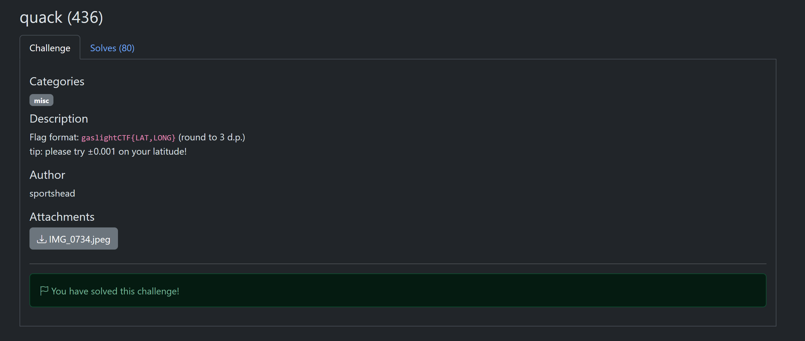
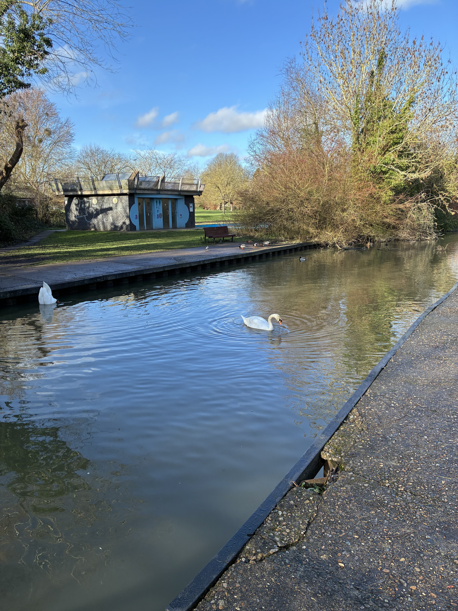
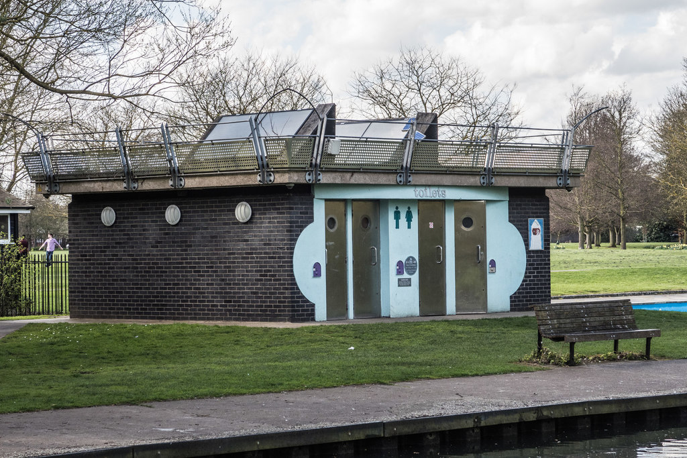

# quack

**Author**: carax49<br>
**Date**: 2026-08-18

## Overview

- Category: OSINT
- Description:

    

## Analysis

The challenge image appears to show a public park. Its main feature is a canal bank, and on the left there is a structure that looks like a public toilet behind a bench.



## Solution

I uploaded the image to Google Images and focused the search on the public toilet.

I found a place that looked very similar to the toilet in the image ([link](https://www.geograph.org.uk/photo/5331751)).



The information below the image included these coordinates:

```text
WGS84: 52:11.7413N 0:6.8868E
```

That gave me the flag.

## Flag

```text
gaslightCTF{52.196,0.115}
```
