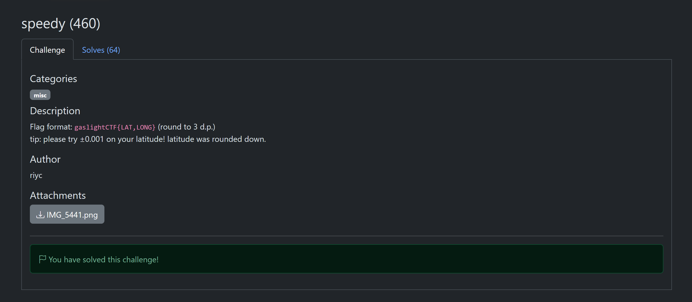
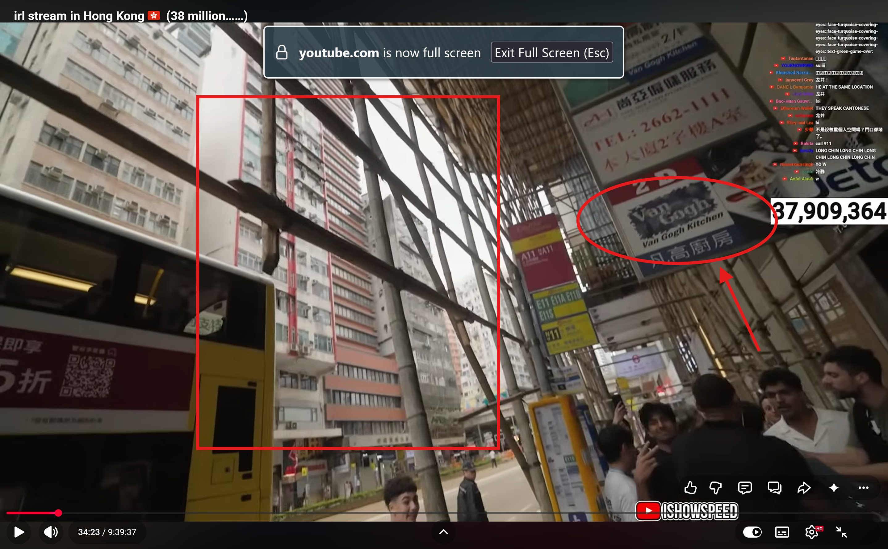
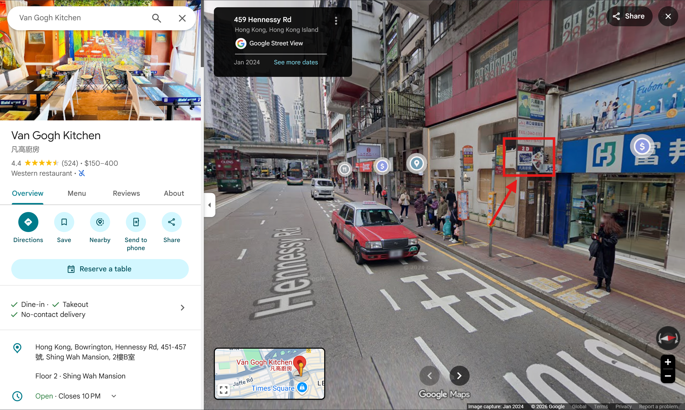
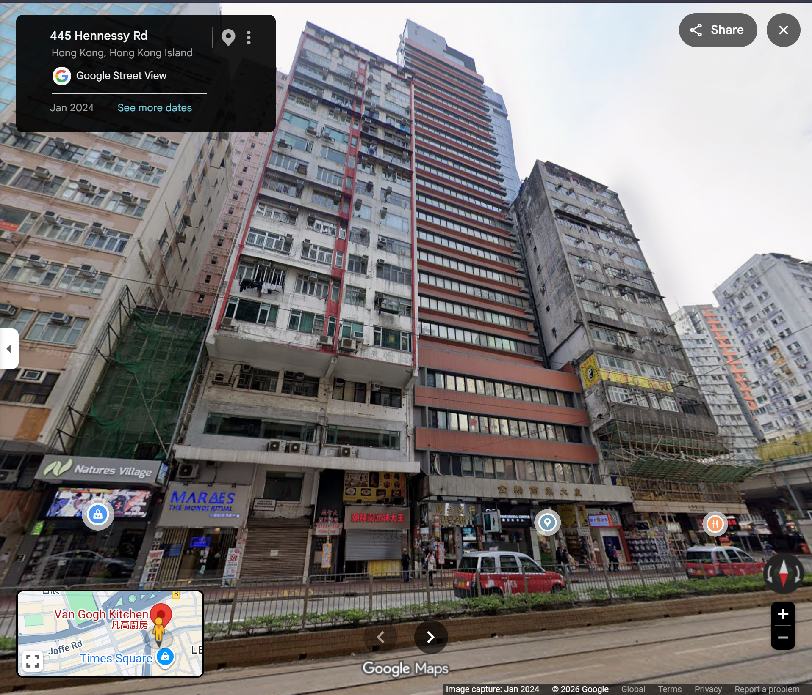
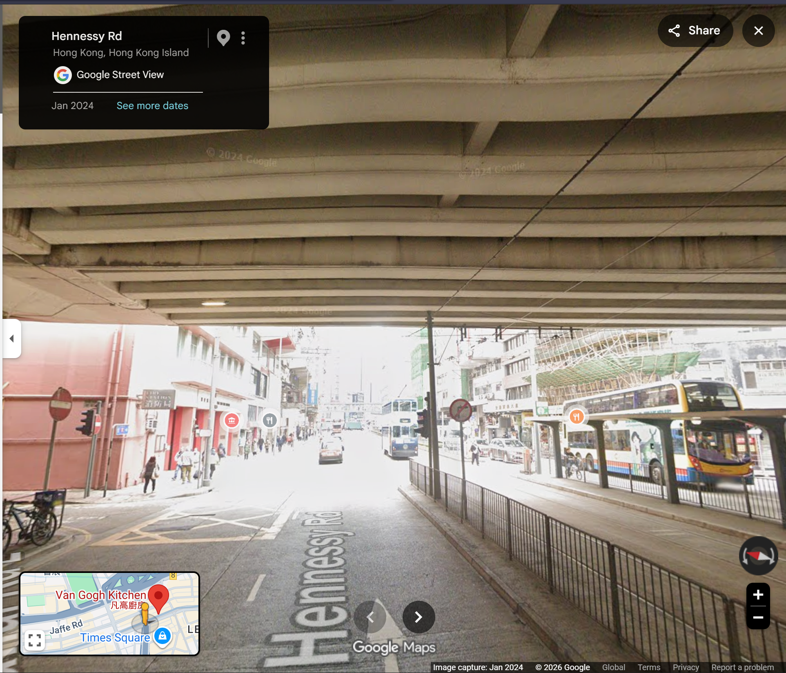

# speedy

**Author**: carax49<br>
**Date**: 2026-08-18

## Overview

- Category: OSINT
- Description:

    

## Analysis


The image shows IShowSpeed during a trip to another country. Based on the people in the background, I could tell it was in Asia.

In the background, there is a bus, several buildings next to each other, and the first building appears to be under construction.

## Solution

From these details, I determined that Speed was visiting Hong Kong.

In [this video](https://www.youtube.com/watch?v=oNS8PHxWdp8), at 34:23:



The building block on the left matches the one in the challenge image.

I also noticed an English restaurant sign: `Van Gogh kitchen`.

I searched for it on Google Maps and found the restaurant's exact location.



The surrounding scenery also matched the video.





This was the exact location I needed.

```text
https://www.google.com/maps/place/Van+Gogh+Kitchen/@22.2794184,114.1811815,3a,75y,79.54h,81.85t/data=!3m7!1e1!3m5!1sO7KMz0C4Z6Ot2g7B3nvfyA!2e0!6shttps:%2F%2Fstreetviewpixels-pa.googleapis.com%2Fv1%2Fthumbnail%3Fcb_client%3Dmaps_sv.tactile%26w%3D900%26h%3D600%26pitch%3D8.15254904591059%26panoid%3DO7KMz0C4Z6Ot2g7B3nvfyA%26yaw%3D79.53984669837286!7i16384!8i8192!4m14!1m7!3m6!1s0x3404005725590e9d:0x372071f1e01af21!2sVan+Gogh+Kitchen!8m2!3d22.2798623!4d114.1819046!16s%2Fg%2F1tc_68dj!3m5!1s0x3404005725590e9d:0x372071f1e01af21!8m2!3d22.2798623!4d114.1819046!16s%2Fg%2F1tc_68dj?entry=ttu&g_ep=EgoyMDI2MDgxMi4wIKXMDSoASAFQAw%3D%3D
```

## Flag

```text
gaslightCTF{22.279,114.181}
```
