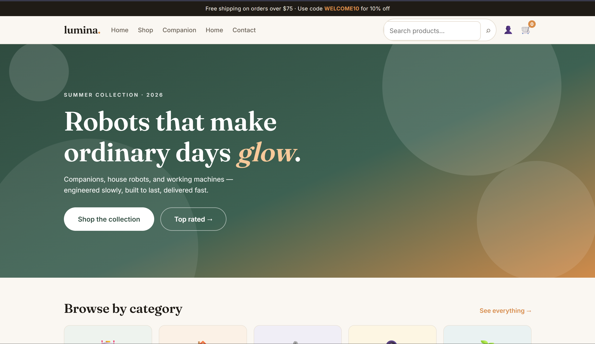
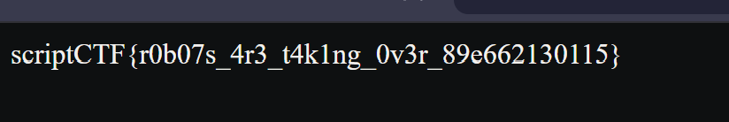

# Midnight Snack

## Information

- Challenge: [404 Found](https://play.scriptsorcerers.xyz/challenges#404%20Found-65)
- Category: Web
- Description:
```text
Please don't hack my shopping cart!
```

## Solution



```text
Robots that make ordinary days glow.
```

This is probably a hint pointing to the `/robots.txt` endpoint.

```text
robots.txt is a file placed in the root folder of a website. It tells web crawlers/search engines which paths they should or should not crawl.
```

I tried visiting the `/robots.txt` endpoint and got:

```text
User-agent: *
Disallow: /the-best-robot
```

Then I tried visiting the `/the-best-robot` endpoint.



## Flag

```text
scriptCTF{r0b07s_4r3_t4k1ng_0v3r_89e662130115}
```