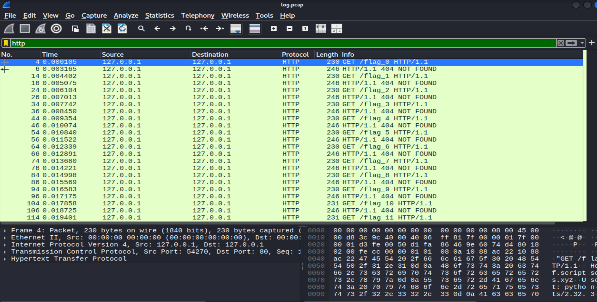
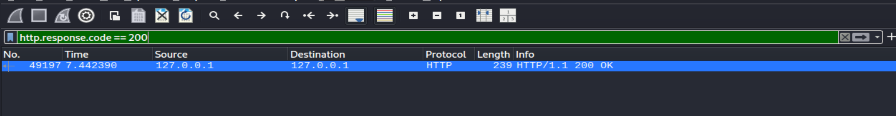
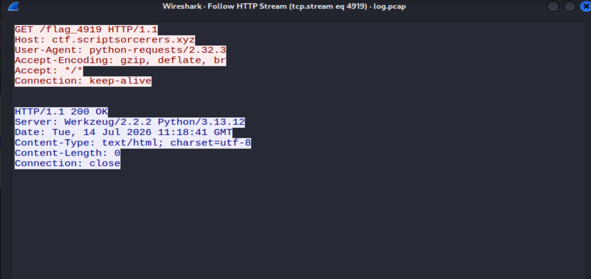
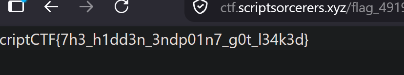

# Bruteforced

**Author**: carax49<br>
**Date**: 2026-08-10

## Overview

- Category: Forensics
- Description:

```text
Help! Our website got bruteforced. Hopefully the attacker did not leak anything.
```

## Analysis

The challenge provides a file called `log.pcap`. I opened it with Wireshark and focused on HTTP traffic.

The HTTP packets caught my attention, so I used a filter to pull them out.



Based on the challenge description and what I saw in Wireshark, this really is a bruteforce attack.

The attacker sent requests one after another:

```HTTP
GET /flag_0 HTTP/1.1
GET /flag_1 HTTP/1.1
GET /flag_2 HTTP/1.1
...
```

But all of them got a `404` status code back.

I then filtered for a response with a `200` status code.



There was only one result. I followed its HTTP stream to inspect it.



```text
GET /flag_4919 HTTP/1.1
Host: ctf.scriptsorcerers.xyz
```

The request `GET /flag_4919` to `ctf.scriptsorcerers.xyz` returned `200 OK` instead of `404 NOT FOUND`.

## Solution

I visited:

```url
https://ctf.scriptsorcerers.xyz/flag_4919
```

And the flag was right there.



## Flag

```text
scriptCTF{7h3_h1dd3n_3ndp01n7_g0t_l34k3d}
```
