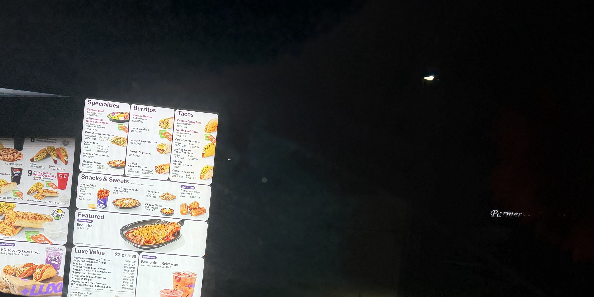
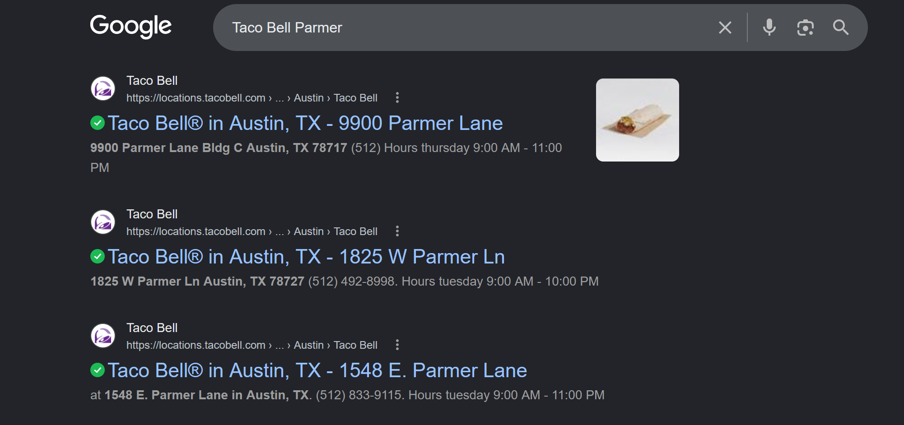
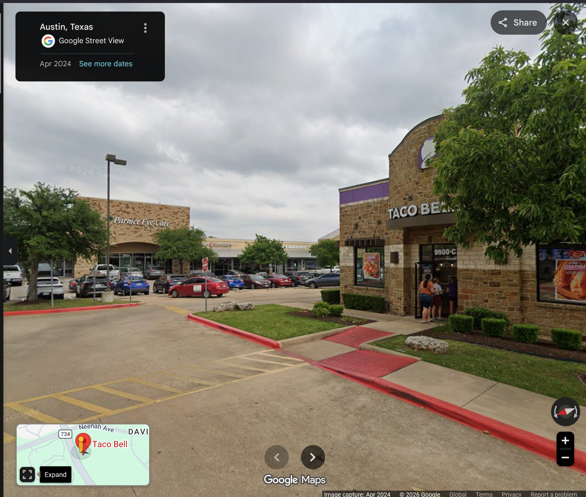
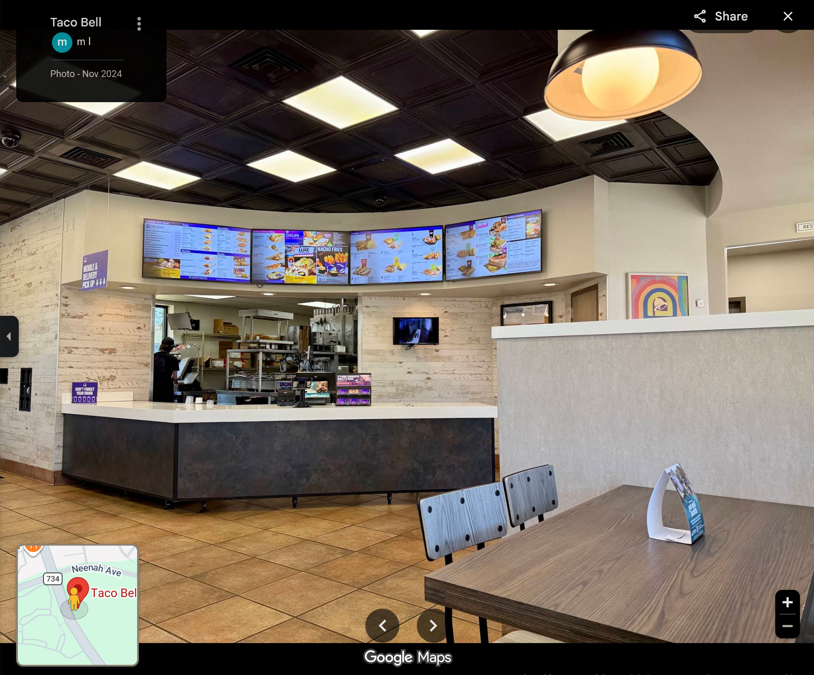

# Midnight Snack

**Author**: carax49<br>
**Date**: 2026-08-10

## Overview

- Category: Geo-OSINT
- Description:
```text
Can you find the address of this Taco Bell? Example: scriptCTF{1337_Orange_St}
```

## Analysis

The challenge provides an image called `tacobell.png`.



The picture shows a Taco Bell menu board, and on the right side of the image, hidden in the dark area, is the word `Parmer`.

Searching for Taco Bell branches on Parmer Lane returned three possible locations.



After comparing all three, the branch at `9900 Parmer Lane` matched the image.





## Solution

The matching location can be viewed at:

```url
https://maps.app.goo.gl/phHMekdg2CNCHR9i6
```

## Flag

```text
scriptCTF{9900_W_Parmer_Ln}
```
