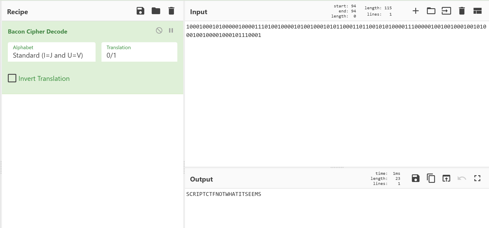

# Misdirection

**Author**: carax49<br>
**Date**: 2026-08-10

## Overview

- Category: Crypto
- Description:

```text
Decode the provided ciphertext to recover the flag.
```

## Analysis

The provided `enc.txt` contains a binary-looking ciphertext:

```text
1000100010100000100001110100100001010010001010110001101100101010000111000001001001000100101000100100001000101110001
```

Using CyberChef's `Bacon Cipher Decode` operation produced:

```text
SCRIPTCTFNOTWHATITSEEMS
```



The result matches the usual flag prefix, but without braces.

## Solution

Add braces around the decoded value:

```text
SCRIPTCTF{NOTWHATITSEEMS}
```

And it worked!

## Flag

```text
SCRIPTCTF{NOTWHATITSEEMS}
```
