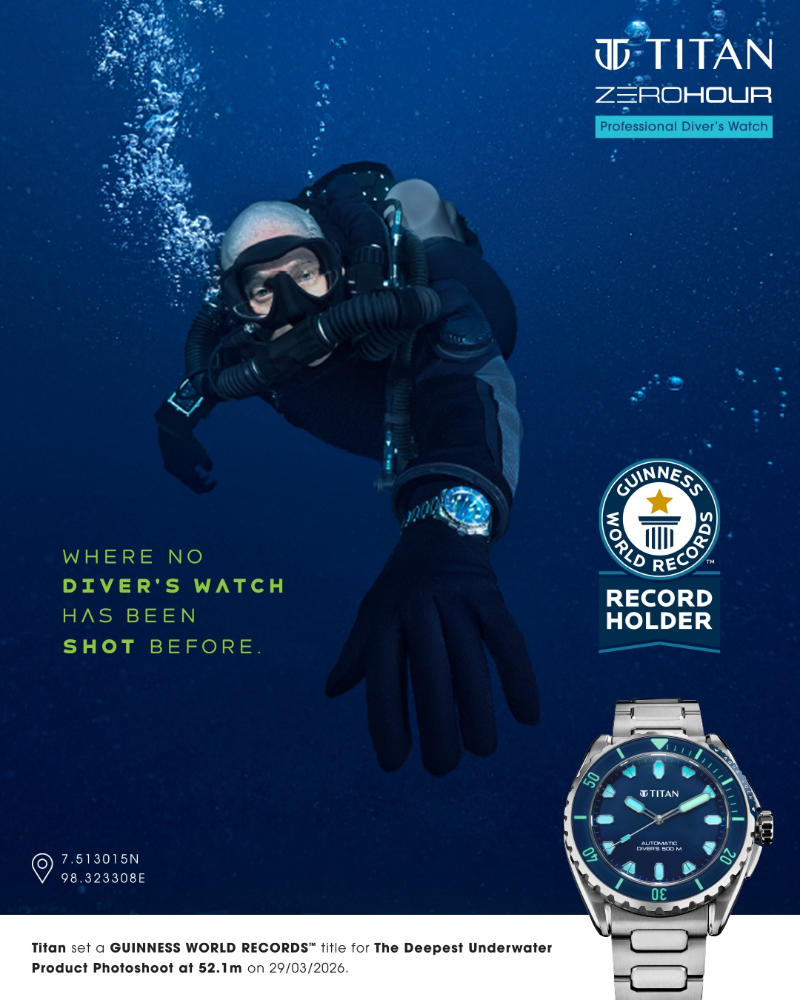

# Titan

**Author**: carax49<br>
**Date**: 2026-08-10

## Overview

- Category: Geo-OSINT
- Description:

```text
Just because it's pertaining to latitude and longitude, it's GEO-OSINT right? Flag is the the latitude and longitude upto 6 decimal places of the location where the deepest underwater product photoshoot happened. Flag format: scriptCTF{13.373737_-13.373737}
```

## Analysis

I searched the web for:

```text
the deepest underwater product photoshoot
```

This led to a photo on [Instagram](https://www.instagram.com/p/DZNkS9umX26/?img_index=3).



The image displays the coordinates directly.

## Solution

Format the displayed latitude and longitude to six decimal places:

## Flag

```text
scriptCTF{7.513015_98.323308}
```
